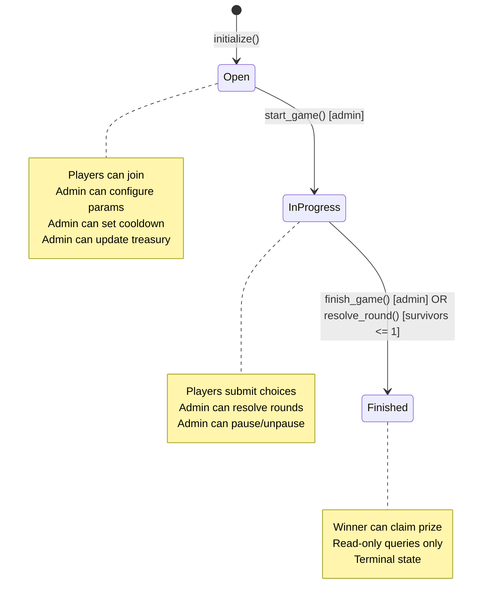
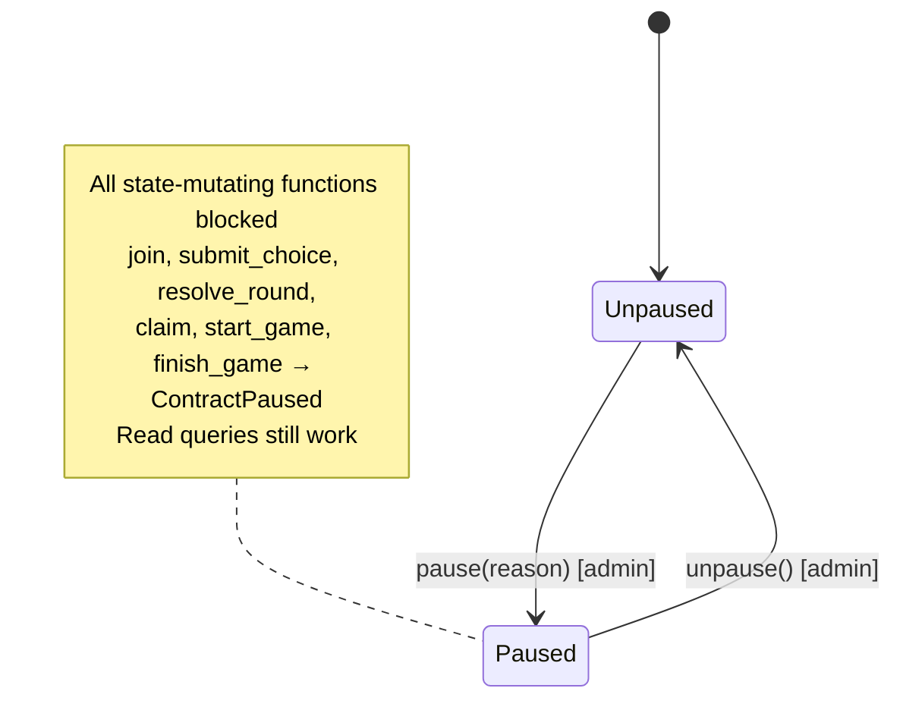

# Arena Smart Contract Architecture

> State machine documentation and transition rules for the arena contract lifecycle.

## Arena Lifecycle State Machine

## State Transition Rules

### Open → InProgress

| Attribute | Detail |
|---|---|
| **Trigger** | `start_game()` |
| **Caller** | Admin only (`config.admin.require_auth()`) |
| **Preconditions** | `config.state == GameState::Open` |
| | `config.paused == false` |
| **Effects** | `config.state = GameState::InProgress` |
| | Emits `START` event |
| **Errors** | `InvalidStateTransition` if not in Open state |
| | `ContractPaused` if contract is paused |
| | `ConfigNotFound` if not initialized |

### InProgress → Finished (admin)

| Attribute | Detail |
|---|---|
| **Trigger** | `finish_game()` |
| **Caller** | Admin only (`config.admin.require_auth()`) |
| **Preconditions** | `config.state == GameState::InProgress` |
| | `config.paused == false` |
| **Effects** | `config.state = GameState::Finished` |
| | Emits `FINISH` event |
| **Errors** | `InvalidStateTransition` if not in InProgress state |
| | `ContractPaused` if contract is paused |

### InProgress → Finished (automatic)

| Attribute | Detail |
|---|---|
| **Trigger** | `resolve_round()` |
| **Caller** | Any (no auth required) |
| **Preconditions** | `config.state == GameState::InProgress` |
| | `config.paused == false` |
| | All active players have submitted choices |
| **Effects** | Eliminates majority/minority based on minority-wins rules |
| | `survivors <= 1` triggers `config.state = GameState::Finished` |
| | Winner address saved to storage |
| | Choices cleared for next round |
| | Emits `ELIM` event per eliminated player |
| **Errors** | `InvalidStateTransition` if not in InProgress state |
| | `ContractPaused` if contract is paused |

## Invalid Transitions

The following state transitions are **explicitly rejected**:

| From | To | Why Invalid |
|---|---|---|
| `Open` | `Finished` | Must pass through `InProgress` (gameplay required) |
| `InProgress` | `Open` | Cannot restart a game in progress |
| `Finished` | `Open` | Terminal state; cannot be reopened |
| `Finished` | `InProgress` | Terminal state; cannot be resumed |

Self-transitions (e.g., `Open → Open`) are also not allowed.

## Edge Cases

### Stuck in Open State
- **Symptom**: Not enough players join before the deadline.
- **Resolution**: Admin can call `configure_arena()` to extend the `join_deadline`. Once enough players join, call `start_game()`.

### Stuck in InProgress State
- **Symptom**: Players are not submitting choices, or tie rounds produce no eliminations.
- **Resolution for non-submissions**: Admin can call `resolve_round()` to process whatever choices exist. Players who did not submit are eliminated.
- **Resolution for perpetual ties**: With more than 2 players, tie rounds have no eliminations; the game continues until choices diverge. Admin can call `finish_game()` as a last resort to end the game in a non-standard way (no winner payout in this path).

### No Players Join
- **Symptom**: Arena initialized but zero players join.
- **Resolution**: Admin starts game via `start_game()`, then calls `finish_game()` immediately. The prize pool is zero; no winner is declared.

### Zero Survivors After Resolution
- **Symptom**: All remaining players are eliminated in a single round (all submit same choice).
- **Effect**: `survivors == 0`, game transitions to `Finished` with no winner. Prize pool remains unclaimed.

### Contract Paused Mid-Game
- **Symptom**: Admin calls `pause()` during `InProgress` state.
- **Effect**: All mutating operations (`join`, `submit_choice`, `resolve_round`, `claim`, `start_game`, `finish_game`) return `ContractPaused`. Read-only queries (`get_config`, `game_state`, `get_player_count`, `winner`, `treasury`) continue to work. Admin must call `unpause()` to restore normal operation.

### Rate Limiting Cooldown
- **Symptom**: A non-admin address attempts to re-initialize the contract within the cooldown period.
- **Effect**: `initialize()` returns `CooldownNotElapsed`. Admin bypasses the cooldown check. Cooldown is configurable via `set_creation_cooldown()`.

## Pause Circuit Breaker

The contract supports an emergency pause mechanism:

## Treasury Fee Collection

Platform fees are routed to a configurable treasury address:

| Operation | Who | Effect |
|---|---|---|
| `initialize(..., treasury_address, ...)` | Deployer | Sets initial treasury address |
| `update_treasury(new_treasury)` | Admin | Updates treasury address |
| `treasury()` | Anyone | Reads current treasury address |

The treasury address is stored in `ArenaConfig` and persists across state transitions. In future implementations, platform fees from prizes and slashed creator stakes will be sent to this address.

## Storage Layout

| Key | Type | Description |
|---|---|---|
| `CONFIG` | `ArenaConfig` | Full arena configuration including state, admin, cooldown, paused flag, treasury |
| `PLAYERS` | `Vec<Address>` | Ordered list of all registered players |
| `{player}` | `bool` | Per-player active status |
| `(CHOICE, {player})` | `Choice` | Per-player per-round choice |
| `WINNER` | `Address` | Winner address (set when game finishes) |
| `ROUND` | `u32` | Current round number |
| `CLAIMED` | `bool` | Whether prize has been claimed |
